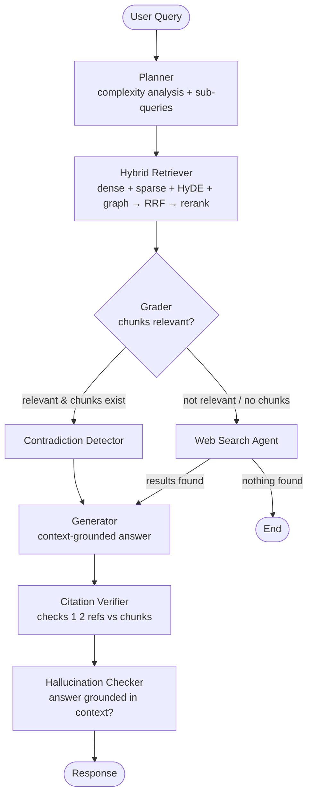
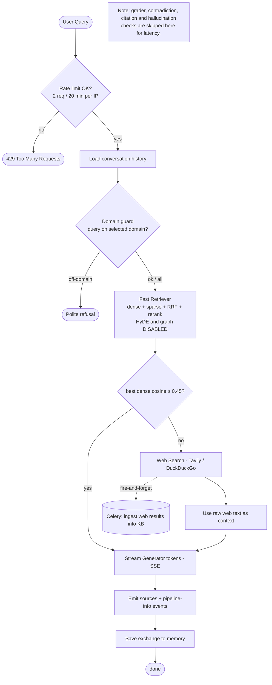
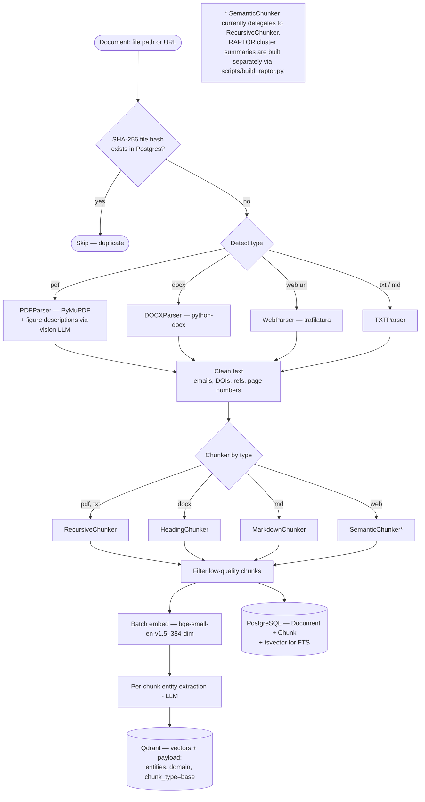
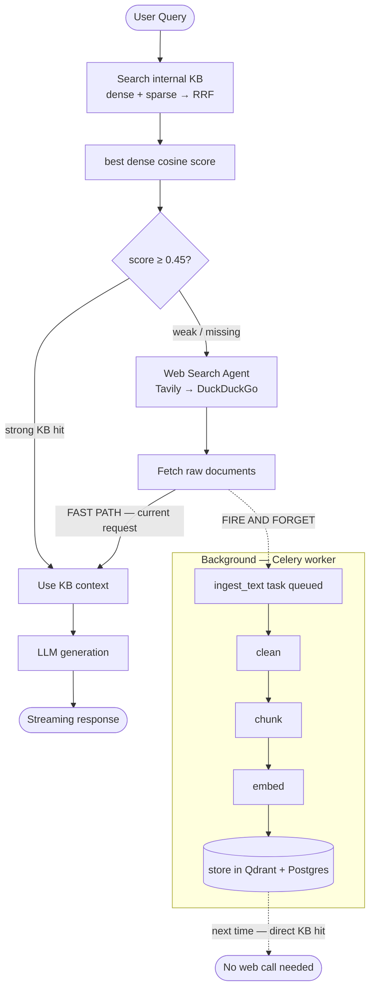
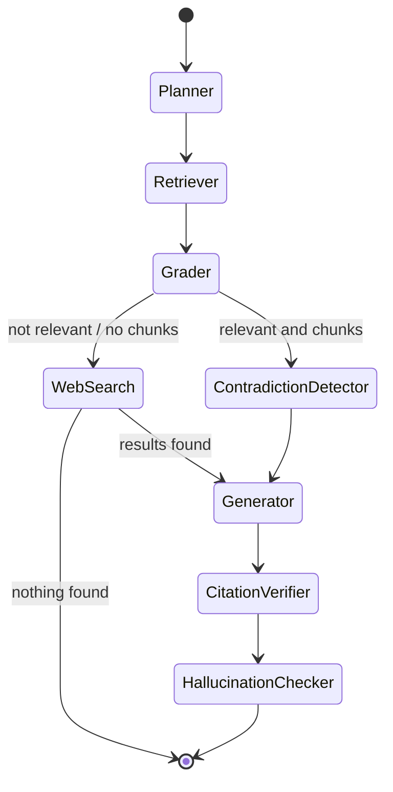
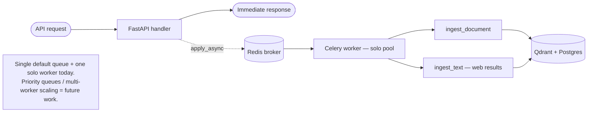
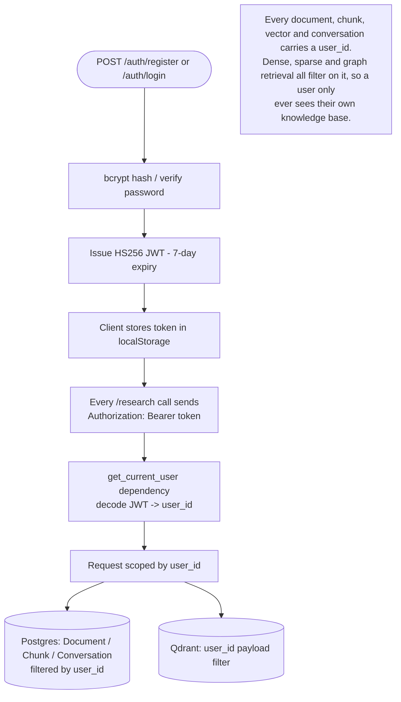
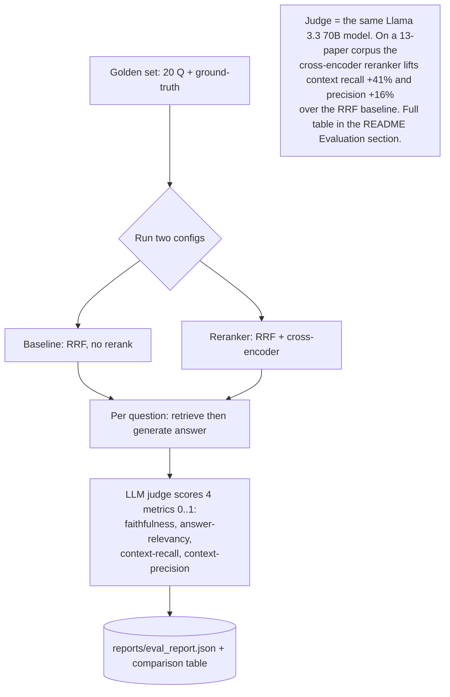

# Verity — Flow Diagrams

> These diagrams reflect the **actual implementation** in `backend/`. Where a
> component is a deliberate simplification or not yet built, it is marked inline.

Verity exposes **two answer paths**:

- **`/research/query`** — the full agentic LangGraph (planner → retriever → grader →
  contradiction → generator → citation verifier → hallucination checker), with
  HyDE + graph retrieval enabled.
- **`/research/query/stream`** — a latency-optimized streaming path used by the chat
  UI: dense + sparse retrieval only (HyDE/graph disabled), token-by-token SSE, and
  the grader/contradiction/citation/hallucination nodes skipped for speed.

---

## 1. Full Agentic Query Flow — `/research/query`

> Source of truth: `backend/agents/graph.py`

---

## 2. Streaming Query Flow — `/research/query/stream` (chat UI)

> Source of truth: `backend/api/routes/research.py`

---

## 3. Hybrid Retrieval (internals)

> Source of truth: `backend/retrieval/hybrid_retriever.py`

```mermaid
flowchart TD
    A([Query]) --> HY[HyDE: generate hypothetical answer<br/>used as dense query - full path only]
    A --> SP[Tokenize for BM25]

    subgraph Stage1["Stage 1 — Candidate fetch (concurrent)"]
        HY --> D[Qdrant cosine search<br/>top 20]
        SP --> S[PostgreSQL FTS - tsvector/GIN<br/>top 20]
        A --> GR[Graph: entity-overlap match<br/>top 10 - full path only]
    end

    subgraph Stage2["Stage 2 — Fusion"]
        D --> RRF[Reciprocal Rank Fusion<br/>score = Σ 1/&#40;k+rank&#41;, k=60]
        S --> RRF
        GR --> RRF
        RRF --> CAND[Top-30 fused candidates]
    end

    subgraph Stage3["Stage 3 — Rerank (if enabled)"]
        CAND --> CE[Cross-encoder rescoring<br/>ms-marco-MiniLM, ONNX]
        CE --> TOP[Final top-k - default 8]
    end

    D --> BD[best_dense_score = max cosine 0–1]
    TOP --> OUT([chunks])
    BD --> THR{best_dense ≥ 0.45?}
    THR -->|yes| USE([Use KB context])
    THR -->|no| FALL([Web search fallback])

    note["Cross-encoder reranking reorders the RRF candidates by query-document<br/>relevance. RRF scores are rank-based (~0.013–0.033), so the web-fallback<br/>decision still uses the raw dense cosine, not the rerank score."]
```

---

## 4. Document Ingestion Pipeline

> Source of truth: `backend/ingestion/pipeline.py` (7 steps)

---

## 5. Adaptive KB — Self-Improving RAG

> Web ka raw content seedha LLM ko milta hai current response ke liye;
> ingestion background mein hoti hai taaki current request block na ho.

---

## 6. LangGraph Agent States

> Source of truth: `backend/agents/graph.py`

---

## 7. Async Task Queue (Celery)

> Source of truth: `backend/workers/celery_app.py`, `backend/workers/tasks.py`

---

## 8. Authentication & Per-User Isolation

> Source of truth: `backend/core/security.py`, `backend/api/dependencies/auth.py`

---

## 9. Evaluation Harness — LLM-as-Judge

> Source of truth: `backend/evaluation/evaluator.py`, `scripts/run_eval.py`

